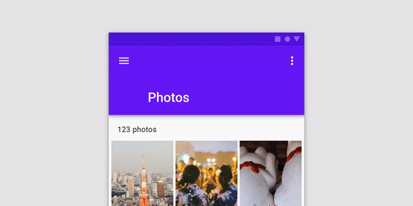
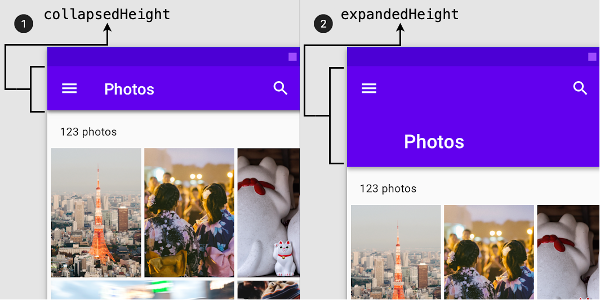
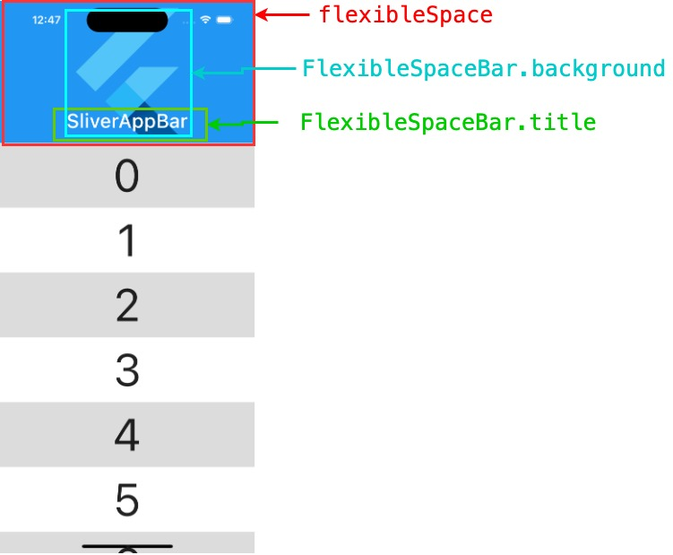
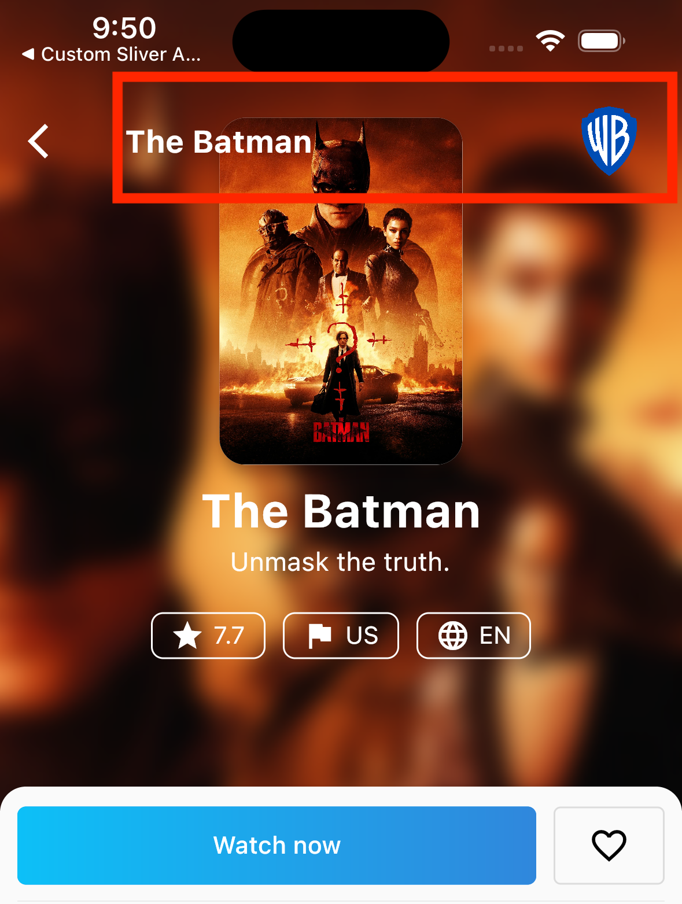
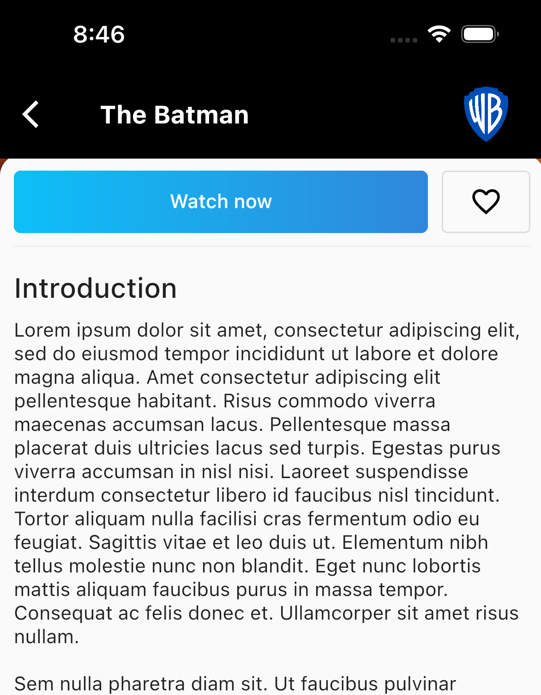
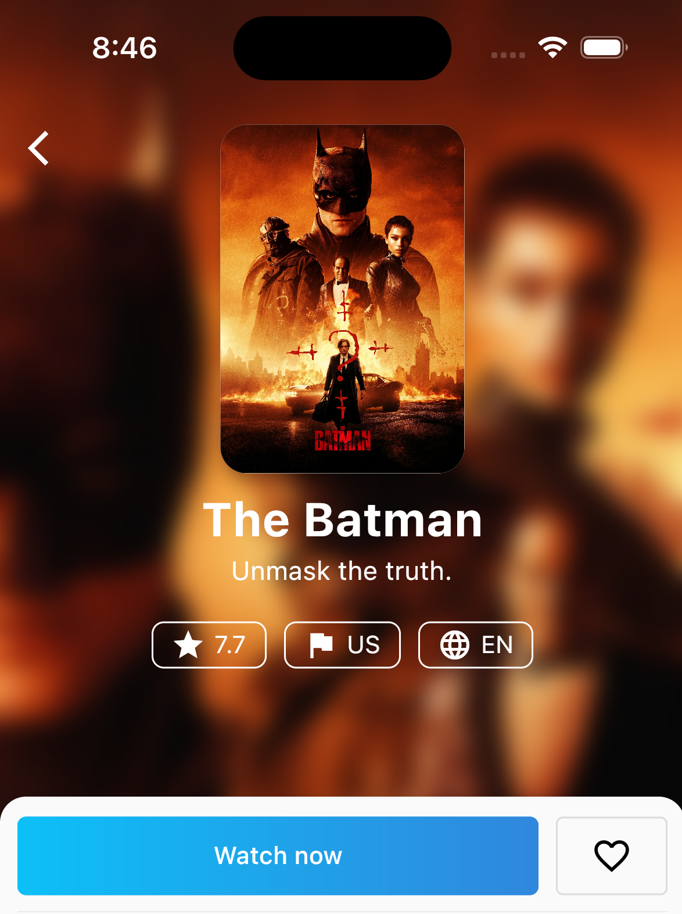

# Flutter SliverAppBar The Complete Guide - Part 1

A guide for creating custom SliverAppBar behaviors in Flutter

## TOC

- [Flutter SliverAppBar The Complete Guide - Part 1](#flutter-sliverappbar-the-complete-guide-part1)
  - [TOC](#toc)
  - [Introduction ℹ️](#introduction-ℹ️)
  - [What We Are Going to Build? 👀](#what-we-are-going-to-build)
  - [Let's Discover SliverAppBar Widget! 🕵🏼](#lets-discover-sliverappbar-widget)
  - [Let's Build it! 🏗](#lets-build-it)
  - [Bouns 🌟](#bouns-)
  - [Wrap up 🏁](#wrap-up)

## Introduction ℹ️

Expanded app bar (Collapsing Toolbar) is one of the material design app bar behaviors that is widely used to hide app bar content when scrolling up. A simple use case is AppBar which might show a full profile picture when the user scrolls down and slowly transition to show only the user name when the user scrolls up.

[](https://m2.material.io/components/app-bars-top#behavior)

In Flutter we can achieve the same behavior using the [SliverAppBar](https://api.flutter.dev/flutter/material/SliverAppBar-class.html) widget. As the widget name suggests it could only be used inside the [CustomScrollView](https://api.flutter.dev/flutter/widgets/CustomScrollView-class.html) widget. This widget helps you in creating various scrolling effects such as lists, grids, and expanding headers by supplying slivers (SliverAppBar, SliverList, SliverGrid ...) directly to it.

**But wait ... What the heck is sliver?** 🧐

> A sliver is just a portion of a scrollable area. That's it! All of the scrollable views you use, like ListView and GridView, are actually implemented using Slivers. You can kind of think of Slivers as a lower-level interface, providing finer-grained control on implementing scrollable areas. Because slivers can lazily build each item just as it scrolls into view, slivers are particularly useful for efficiently scrolling through large numbers of children. -  [Slivers, Demystified](https://medium.com/flutter/slivers-demystified-6ff68ab0296f)

## What We Are Going to Build? 👀

We are going to build the following custom behavior:


## Let's Discover SliverAppBar Widget! 🕵🏼

```dart
SliverAppBar(
  pinned: _pinned,
  snap: _snap,
  floating: _floating,
  expandedHeight: 160.0,
  collapsedHeight: 80.0,
  flexibleSpace: const FlexibleSpaceBar(
    title: Text('SliverAppBar'),
    background: FlutterLogo(),
  ),
),
```

As mentioned previously this widget is used directly in the CustomScrollView and it contains helpful properties to customize its behavior.

The most important properties are:

We will focus on these properties:

- `collapsedHeight`: a double value that defines the height of the app bar when it's collapsed.
- `expandedHeight`: a double value that defines the height of the app bar when it's expanded.

- `flexibleSpace`: This widget is stacked behind the toolbar and the tab bar and it's usually used with the [`FlexibleSpaceBar`](https://api.flutter.dev/flutter/material/FlexibleSpaceBar-class.html) widget. The FlexibleSpaceBar widget contains properties to customize the space when the app bar is expanded.



We will focus on two properties:

- The `title` is a widget that gets animated (scaled up/down) when collapsing/expanding the app bar.
- The `background` is a widget that fades out when the app bar is collapsed.

- There are other properties that control the behavior of the collapsed app bar whether it's `pinned`, `floating`, `snap`, and more. To learn more check [the official documentation](https://api.flutter.dev/flutter/material/SliverAppBar-class.html).

## Let's Build it! 🏗

First of all, we will use the [`flutter_hooks`](https://pub.dev/packages/flutter_hooks) package to make it easier to manage the local state and deal with the ScrollControllers. But of course, you can use `StatefulWidget` and `setState` or any other local state management solution.

Let's start by adding theStack widget to add the movie background image and the CustomScrollView widget to be able to use the SliverAppBar.

```dart
class MovieProfilePage extends HookWidget {
  const MovieProfilePage({super.key, required this.movieDetails});
  final MovieDetails movieDetails;
  @override
  Widget build(BuildContext context) {
    return Stack(
      children: [
        /// The background image
        BlurredBackdropImage(movieDetails: movieDetails),
        CustomScrollView(
          slivers: [
            
          ],
        ),
      ],
    );
  }
}
```

Now let's add the SliverAppBar inside the CustomScrollView.

```dart
@override
  Widget build(BuildContext context) {
    const collapsedBarHeight = 60.0;
    const expandedBarHeight = 400.0;

    return Stack(
      children: [
        /// Blurred Background Image Widget
        BlurredBackdropImage(movieDetails: movieDetails),
        CustomScrollView(
          slivers: [
            SliverAppBar(
              expandedHeight: expandedBarHeight,
              collapsedHeight: collapsedBarHeight,
              centerTitle: false,
              pinned: true,
              /// 1
              title: CollapsedAppBarContent(movieDetails: movieDetails),
              elevation: 0,
              /// 2
              backgroundColor: Colors.transparent,
              leading: const BackButton(
                color: Colors.white,
              ),
              /// 3
              flexibleSpace: FlexibleSpaceBar(
                background: ExpandedAppBarContent(
                  movieDetails: movieDetails,
                ),
              ),
            ),

            /// 4
            SliverToBoxAdapter(
              child: ConstrainedBox(
                constraints: BoxConstraints(
                  minHeight: MediaQuery.of(context).size.height,
                ),
                child: Material(
                  elevation: 7,
                  borderRadius: const BorderRadius.only(
                    topLeft: Radius.circular(15),
                    topRight: Radius.circular(15),
                  ),
                  child: PageBodyWidget(movieDetails: movieDetails),
                ),
              ),
            )
          ],
        ),
      ],
    );
  }
}
```

1. Adds the `CollapsedAppBarContent` widget that contains the top `Row` to the title field. The title widget will always stay visible.
1. Changes the AppBar `background` color to `transparent` to show the `BlurredBackdropImage` widget.
1. Adds `FlexibleSpaceBar` widget and assigns the `ExpandedAppBarContent` widget to the background field. The `background` field content fades out when the app bar collapsed, and this is exactly what we need!
1. Adds `SliverToBoxAdapter` widget to be able to add the body content. Simply, what the `SliverToBoxAdapter` does is just a bridge between slivers and regular widgets (i.e. box-based widgets). Since the `CustomScrollView` can only have slivers objects as direct descendants.

The app bar now would look like this:


Now if we analyze the required design we would find out that we have the `CollapsedAppBarContent` widget is overlapping the `ExpandedAppBarContent` widget. Also when the app bar is collapsed we need to change the background color to black instead of transparent.

**But how could we achieve this behavior? 👀**

First of all, we need to know whether the AppBar is collapsed or expanded; based on this we could show the proper content of the AppBar.

To do this, we could use the `NotificationListener` widget and listen to the `ScrollNotifications` to detect the changes in the scroll offset. Based on that, we could know if the app bar is either collapsed or expanded.

```dart
@override
  Widget build(BuildContext context) {
    ...
    /// 1
    final scrollController = useScrollController();
    final isCollapsed = useState(false);

    return NotificationListener<ScrollNotification>(
      onNotification: (notification) {
        /// 2
        isCollapsed.value = scrollController.hasClients &&
            scrollController.offset > (expandedBarHeight - collapsedBarHeight);
        return false;
      },
      child: Stack(
        children: [
          BlurredBackdropImage(movieDetails: movieDetails),
          CustomScrollView(
            controller: scrollController,
            slivers: [
              SliverAppBar(
                expandedHeight: expandedBarHeight,
                collapsedHeight: collapsedBarHeight,
                centerTitle: false,
                pinned: true,
                /// 3
                title: AnimatedOpacity(
                  duration: const Duration(milliseconds: 200),
                  opacity: isCollapsed.value ? 1 : 0,
                  child: CollapsedAppBarContent(movieDetails: movieDetails),
                ),
                elevation: 0,
                /// 4
                backgroundColor:
                    isCollapsed.value ? Colors.black : Colors.transparent,
                leading: const BackButton(
                  color: Colors.white,
                ),
                flexibleSpace: FlexibleSpaceBar(
                  background: ExpandedAppBarContent(
                    movieDetails: movieDetails,
                  ),
                ),
              ),
              ...
            ],
          ),
        ],
      ),
    );
  }
```

1. Uses two hooks, `useScrollController()` hook to create `ScrollController` and a `useState()` hook with a `false` initial value to create the `isCollapsed` state object. The `isCollapsed` flag will be used to update app bar content based on its value.
1. Updates the `isCollapsed` state value by checking that the `scrollController` object is attached to the scroll view. Moreover, it checks whether the current scroll offset is larger than the difference between the `expandedBarHeight` and `collapsedBarHeight`.
1. Wraps the `CollapsedAppBarContent` widget with `AnimatedOpacity` widget to hide and show the content based on the `isCollapsed` value.
1. Changes the `backgroundColor` based on the `isCollapsed` value.

The app bar now would look like this:



**And hurray we did it! 🎉🎊**

## Bouns 🌟

We could also add haptic feedback when the app bar is collapsed to further improve the user experience. We can do this by using the HapticFeedback class, which allows access to the haptic feedback interface on the device.

```dart
@override
  Widget build(BuildContext context) {
    ...
    final didAddFeedback = useState(false);

    return NotificationListener<ScrollNotification>(
      onNotification: (notification) {
        ...
        /// When the app bar is collapsed and the feedback 
        /// hasn't been added previously will invoke 
        /// the `mediumImpact()` method, otherwise will 
        /// reset the didAddFeedback value.
        ///
        if (isCollapsed.value && !didAddFeedback.value) {
          HapticFeedback.mediumImpact();
          didAddFeedback.value = true;
        } else if (!isCollapsed.value) {
          didAddFeedback.value = false;
        }
        return false;
      },
      child: Stack(
        children: [
              ...
            ],
          ),
        ],
      ),
    );
  }
```

We added another hook state variable named didAddFeedback based on it will call the `HapticFeedback.mediumImpact()` method.

## Wrap up 🏁

The slivers help you to customize the scrolling behavior and to build complex scrolling effects. Mastering slivers will enable you to improve the user interface and, more importantly, the experience.

Thanks for reading! ❤️
